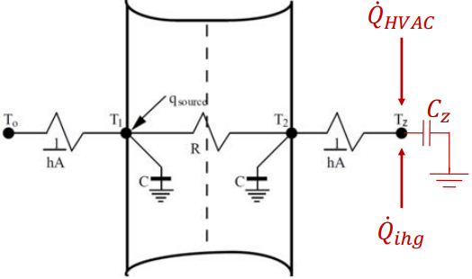
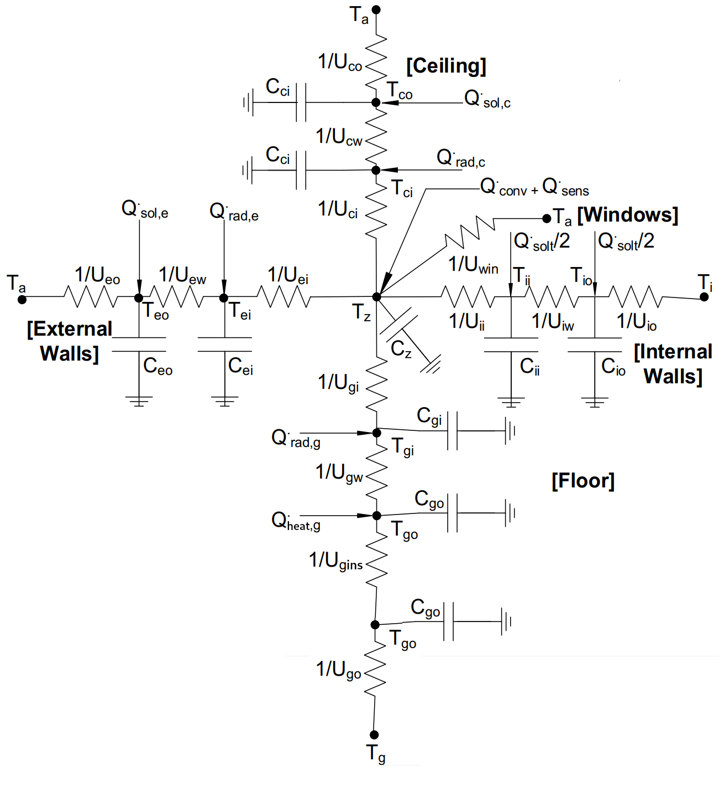

# Theory
This document contains my notes on the topic of MPC, Modeling of Cyber-Physical systems, basic Calculus etc. I make this for my own understanding of the topic and there may be some mistakes. (if you see them feel free to correct them or tell me about them)

## Differential Equations

 - **Ordinary differential equation (ODE)** - all derivatives are with respect to a single independent variable (time in our case)
 - **Order** of ODE is determined by highest-order derivative of state variable function appearing in the ODE
### Higher Order systems
ODE with higher-order derivatives can be transformed into equivalent first-order system
for $k$-th order ODE:
$$y^{(k)}(t) = f(t,y,y',\dots,y^{(k-1)})$$
define $k$ new unknown functions:
$$u_1(t) = y(t), u_2(t) = y'(t),\dots,u_k(t)=y^{(k-1)}(t)$$
Then original ODE is equivalent to following first order system
$$
 \begin{bmatrix}
  u_1'\\
  u_2'\\
  \vdots\\
  u_{k-1}'\\
  u_k''\\
 \end{bmatrix}
 = 
 \begin{bmatrix}
  u_2(t)\\
  u_3(t)\\
  \vdots\\
  u_k(t)\\
  f(t, u_1, u_2,\dots, u_k)\\
 \end{bmatrix}
$$

## Static vs Dynamic System
### Definitions
 - **System** is a mapping of time dependent inputs to time dependednt outputs. 
 - **State** amount of variables (inputs) we can mesure which is enough to predict future behaviour (outputs) of the system in the absence of any inputs
 - **State Space** is the set of all possible combinations of state variable values.
- **Static system**
  - Output is determined only by the current input and reacts instantaneously
  - Relationship between input and ouptut does not change with time
  - Can be represented by a algebraic equation
- **Dynamic system**
  - Output takes time to react (system has "memory")
  - Relationship between input and output changes with time - depends on past inputs and initial conditions
  - Can be represented by a defferential equation $$\frac{dx}{dt} = x' = f(x(t), u(t), t)$$
  - the state $x(t_1)$ at any future time can be determined exactly given knowledge of the initial state $x(t_0)$ and the time historey of the inputs $u(t)$ between $t_0$ and $t_1$

### State-Space representation of models
$$\frac{dx}{dt} = x' = f(x(t), u(t), t)$$
- In reality many systems that we observe the the underlying phisical laws do not typically depend on time, so the functino $f$ looks like this $$\frac{dx}{dt} = x' = f(x,u)$$
- Input $u(t)$ may be time dependent
- The parameters/constats which describe the function f remain the same
- Over sufficiently small operating range (ie. tangent line near a curve) the dynamics of most systems are approximately **linear** $$x' = Ax + Bu$$
- **State Space Model** represents a syustem by a series of first-order differential state equations and algebraic output equations. The differential equations need to be rearranged as a series of first order differential equations.
- The State-Space modeling Process:
  1. Identify input variables (actuators and exogenous inputs)
  2. Identify output variables (sensors and performance variables)
  3. Identify state variables (independent energy storage)
  4. Use principles of physics to relate derivative of state variables to the input, state and output variables
- Why use state-space representations?
  1. numerically efficient to solve
  2. can handle complex systems
  3. allow for more geometric uderstandic of dynamic systems
  4. form the basis for much of modern control theory
- **continuous-time linear dynamic systems**
  Continuous-time linear dynamic systems can be described using following state-space representation
  $$x' = A(t)x(t) + B(t)u(t)$$
  $$y = C(t)x(t) + D(t)u(t)$$
  where
    -  $A(t) \in \mathbb{R}^{n \times n}$ is the dynamics matrix
    -  $B(t) \in \mathbb{R}^{n \times m}$ is the input matrix
    -  $C(t) \in \mathbb{R}^{p \times n}$ is the output or sensor matrix
    -  $A(t) \in \mathbb{R}^{p \times m}$ is the feedthrough matrix

  - Most systems are _time-invariant_ - $A$ ,$B$, $C$, $D$ are constant (do not vary with time)
  - When there is no input (no B and D), system is called autonomous
  - very ofthen there is no feedthrough (D = 0)

- **Example**:
  Consider following system where $u(t)$ is the input and $x'(t)$ is the output. $$x''' + 5x'' + 3x' +2x = u,y = x'$$

  _Task_: Rewrite this dynamical system in state space.
    1. Create a state-space model by pure mathematical manipulation through changing variables $$x_1 = x, x_2 = x', x_3 = x''$$ Resulting in three first order differential equations - **State equations**: $$x_1' = x_2$$ $$x_2' = x_3$$ $$x_3' = -5x_3 - 3x_2 - 2x_1 +u $$
    And one **Output Equation**: $$y = x_2$$
    System has 1 input ($u$), 1 output ($y$) and 3 state variablex ($x_1, x_2, x_3$).
    2. Rewrite the equations in state-space representation form
    $$
    \begin{pmatrix}
    x_1' \\
    x_2' \\
    x_3' \\
    \end{pmatrix}
    =
    \begin{pmatrix}
    0 & 1 & 0 \\
    0 & 0 & 1 \\
    -2 & -3 & -5 \\
    \end{pmatrix}
    \begin{pmatrix}
    x_1 \\
    x_2 \\
    x_3 \\
    \end{pmatrix}
    + 
    \begin{pmatrix}
    0 \\
    0 \\
    1 \\
    \end{pmatrix}
    u
    $$
    $$
    \begin{pmatrix}
    y \\
    \end{pmatrix}
    =
    \begin{pmatrix}
    0 & 1 & 0 \\
    \end{pmatrix}
    \begin{pmatrix}
    x_1 \\
    x_2 \\
    x_3 \\
    \end{pmatrix}
    + 
    \begin{pmatrix}
    0 \\
    \end{pmatrix}
    u
    $$

# 3R2C model theory

## Definitions
 - **Heat $Q$** - energy transferred across system boundary by temperature difference ($J$)
 - **Heat flow (rate) $Q$** - heat transfer rate (W)
 - **Heat flux** - heat flow rate through a surface. **Heat flux density** is heat flux per unit area ($W/m^2$)
 - **Heat capacity $C$** - heat needed to raise temperature of a body mass by 1C ($J/K$). Also called _thermal mass_, _thermal capacitance_
 - **Specific heat (capacity) $C_p$** - heat needed to raise temperature of 1 kg of material by 1C ($J / kg \times K$); $C = mC_p = \rho V C_p$ 
 - **Energy change** -  by temperature change $\Delta E = \rho V C_p \Delta T $
 - **Mass flow rate $m'$ ($kg/s$)** and **Volume flow rate $V'$ ($m^2/s$)**; $m' = \rho V'$

## Heat Transfer
 If mass $m_1$ of a substance is heated from temperature $T_1$ to $T_2$, the amount of heat H which it aquires is given by $$H = m_1 C_p (T_2 - T_1)$$
 Where $C_p$ is specific heat of the substance

### HVAC Zone heating
Supply air temperature $T_s$, return air temperature $T_r < T_s$, volume flow rate $V$. Heat transfered to zone is:$$Q' = H' = \rho V' C_p(T_s-T_r) [W]$$
Wgere $\rho V'$ is mass flow rate and $Q'$ is Heat flow.

## Components of building Heat losses/gains
- Gains - Heat flows in
- Losses - Heat flows out
- Sensible gain/cooling - Change the temperature of the interior air - can be imediately sense the change
- Latent gain/cooling - change the humidity of the interior air - does impact thermal comfort but not imediately obvious

## Mechanisms of heat transfer
- Conduction
  - Conduction is the process of heat thransfer through a substance such as wall from higher to lower temperature
  - Can be described by a simplified equation (timeless and one-dimensional) $$Q' = kA \frac{\Delta T}{\Delta x} = kA \frac{T_h - T_l}{l}$$ Where:
    - $k$ is thermal conductivity ($W/mk$)
    - $A$ is cross sectional area ($m^2$)
    - $T_h$ is high temperature
    - $T_l$ is low temperature
    - $l$ is thickness of the material.
  - Conduction through a wall $$Q' = kA \frac{T_o - T_i}{L}$$ $$Q' = \frac{T_o - T_i}{R_w}; R_w = \frac{L}{kA}$$ $R_w$ is defined to describe the resistance of the wll. We define it like this because it's then easier to look at conduction as an electric cirquit with a resistor ($T$ is potential, $\Delta T$ is voltage, $Q'$ is current and $R_{th} is resistance). $$Q'R_{th} = T_h - T_l$$ $R_{th} = \frac{1}{kA}$ is a **thermal resistance**
  - Thanks to this representation we can model a composite wall as a single Resistor (circuit with resistors in series and parallel) ie. $R_1$ ,$R_2$ , $R_3$ in series and $R_4$, $R_5$, $R_6$ as well and both groups connected in parallel would be described using following equation: $$R_T = \frac{1}{\frac{1}{R_1 + R_2 + R_3} + \frac{1}{R_4 + R_5 + R_6}}$$
- Convection
  - Convection is the heat transfer between a surface and fluid/gas by the movement of the fluid/gas
  - Described using Newton's law of cooling: $$Q' = hA \Delta T$$ where:
    - $h$ is heat transfer coefficient ($W/m^2K^2$)
    - $A$ is surface area ($m^2$)
    - $\Delta T$ is temperature differecne between surface and fluid
    - Similar to Conduction we can define $R_{CV} = \frac{1}{hA}$ and write $Q'R_{CV} = \Delta T$
- Radiation
  - Radiation is the heat transfer through space by electromagnetic waves
    - radiation between a radiator and a wall that faces it
    - sun shining on a wall (indirect room heating)
    - sun shining through a window (direct room heating)
  - Approximate linearized equation $$Q' = \epsilon h_rA(T_1 -T_2)$$ where:
    - $\epsilon$ is emisivity of the surface (0.9 for most building materials)
    - $h_r$ is radiation heat transfer coefficient ($W/m^2 K$)
  - For Radiation we can define $R_r = \frac{1}{\epsilon h_r A}$ and write $$Q'R_r = \Delta T$$
 
## Single Zone Model
To be able to model a single zone we need to have information about
- properties of all materials used
- geometry of the zone - surface area, surface thickness, volume
- operation - internal heat gains, cooling/heating, outside air, solar heat gain, ...

### Surfaces we need to model
- External walls
  - Outside surface - ambient temperature outside
  - Inside surface - zone temperature
- Ceiling
  - Outside surface - ambient temperature or floor temperature of the zone above
  - Inside surface - zone temperature
- Ground
  - Outside surface - ground temperature or zone below temperature
  - Inside surface - zone temperature
- Internal walls
  - Outside surface - temperature in adjacent zones
  - Inside surface - zone temperature
- Windows/doors

### Heat gains
- SOlar Irradiance $Q_{sol}$
  - External wall
  - Attic
- Solar radiation transmitted through windows $Q_{sol,t}$
  - absorbed by zone air and internal surfaces
- Radiative internal heat gain $Q_{rad}$
  - Distributerd evenly on all internal surfaces
- Convective heat gain $Q_{conv}$
  - With adjacent zones
- HVAC heat gain $Q_{HVAC}$ or $Q_{sens}$
- Floor heating gain $Q_{floor}$
- Boundary temperatures

## Single wall heat transfer model

- $T_1$, $T_2$ - two interior nodes for each surface
- $T_o$, $T_z$ - convection on both sides
- $q_{source}$ - direct heat input to $T_1$ (sunlight)
- $Q'_{igh}$ - internal heat gain to the zone
- $Q'_{HVAC}$ - HVAC/heating heat gain to the zone
- $C_{z}$ - Zone heat capacity

We assume that the **air inside is well mixed** and that **all walls can be described by a single temperature**. 

### Model
$$C \frac{dT_1}{dt} = hA(T_o - T_1) + \frac{T_2-T_1}{R} + Q_{source}A$$
$$C \frac{dT_2}{dt} = hA(T_z - T_2) + \frac{T_1-T_2}{R}$$
$$C_z \frac{dT_z}{dt} = hA(T_2 - T_z) + Q'_{igh} + Q'_{HVAC}$$

Where:
- $R = \frac{l}{kA}$
- $C = \frac{\rho c_p l A}{2}$
  - the $C$ is divided by two because there are two states in this model ($T_1$ and $T_2$) and we need to have 1 energy storage for each state
- $q_{source}$ - Heat flux $W/m^2$ (solar irradiance)

Then we have:
- States - $T'_1$, $T'_2$, $T'_z$
- Inputs - $T_o$, $q_{source}A$, $Q'_{ihg}$, $Q'_{HVAC}$
- Parameters (unknown) - $h$, $R$, $A$, $C$, $C_z$

This model can be converted into equivalient State-Space form ($x' = Ax + Bu$):
    $$
    \begin{pmatrix}
    T_1' \\
    T_2' \\
    T_z' \\
    \end{pmatrix}
    =
    \begin{pmatrix}
    \frac{-hA}{C} - \frac{1}{RC} & \frac{1}{RC}                 & 0               \\
    \frac{1}{RC}                 & \frac{-hA}{C} - \frac{1}{RC} & \frac{hA}{C}    \\
    0                            & \frac{hA}{C_z}               & \frac{-hA}{C_z} \\
    \end{pmatrix}
    \begin{pmatrix}
    T_1 \\
    T_2 \\
    T_z \\
    \end{pmatrix}
    + 
    \begin{pmatrix}
    \frac{hA}{C} & \frac{1}{C} &               & 0             \\
    0            & 0           & 0             & 0             \\
    0            & 0           & \frac{1}{C_z} & \frac{1}{C_z} \\
    \end{pmatrix}
    \begin{pmatrix}
    T_0 \\
    w_{source}A \\
    Q'_{ihg} \\
    Q'_{HVAC} \\
    \end{pmatrix}
    $$
The output equation $y(t) = Cx(t) + Du(t)$ is then:
  $$T_z = 
    \begin{pmatrix}
    0 & 0 & 1 \\
    \end{pmatrix}
    \begin{pmatrix}
    T_1 \\
    T_2 \\
    T_z \\
    \end{pmatrix}
    +
    \begin{pmatrix}
    0 \\
    \end{pmatrix}
    \begin{pmatrix}
    T_0 \\
    w_{source}A \\
    Q'_{ihg} \\
    Q'_{HVAC} \\
    \end{pmatrix}
  $$

## Applying single wall model to entire zone
### Floors, Ceilings, Walls, ..
- To simplify the wall resistance equation instead of using $\frac{1}{hA}$ (convective reesistance) we will use $$R_{thermal_resistance} = \frac{1}{U_{thermal_conduction}}$$
- We can make the thermal capacity of the wall "halfs" non-equal (but we don't have to)
- Floors and Ceilings are walls too
### Windows, doors, ...
- little to no thermal mass - only thermal resistance
- modelling the window as a single resistor $R = \frac{1}{U_{win}}$
## RC modelling methodology
1. **All exterior walls are combined into a single exterior wall**
    - External boundary conditions
      - Outside air temperature
      - Incident solar irradiation
2. **Windows/doors (without thermal mass)**
    - modelled only as a resistive element
3. **Ground and ceiling with appropriate boundary conditions**
    - outside temperature - ground temp, another zone, ...
4. **Internal walls with adjacent zones and/or partitions**
5. **Inputs**
    - Heat gains to the zone temperature
    - Solar Iradiance
    - All boundary temperatures

## Zone example

NOTE: I've added the $Q_{heat,g}$ into the ground as this is the relevant example for me (underfloor heating)

### External wall equations
$$C_{eo}T'_{eo}(t) = U_{eo}(T_{a}(t) - T_{eo}(t)) + U_{ew}(T_{ei}(t) - T_{eo}(t)) + Q'_{sol,e}(t)$$
$$C_{ei}T'_{ei}(t) = U_{ew}(T_{eo}(t) - T_{ei}(t)) + U_{ei}(T_{z}(t) - T_{ei}(t)) + Q'_{rad,e}(t)$$

### Ceiling equations (example where ceiling == roof)
$$C_{co}T'_{co}(t) = U_{co}(T_{a}(t) - T_{co}(t)) + U_{cw}(T_{ci}(t) - T_{co}(t)) + Q'_{sol,c}(t)$$
$$C_{ci}T'_{ci}(t) = U_{cw}(T_{co}(t) - T_{ci}(t)) + U_{ci}(T_{z}(t) - T_{ci}(t)) + Q'_{rad,c}(t)$$

### Interior wall equations
$$C_{io}T'_{io}(t) = U_{io}(T_{i}(t) - T_{io}(t)) + U_{cw}(T_{ii}(t) - T_{io}(t)) + \frac{Q'_{solt,c}(t)}{2}$$
$$C_{ii}T'_{ii}(t) = U_{iw}(T_{io}(t) - T_{ii}(t)) + U_{ii}(T_{z}(t) - T_{ii}(t)) + \frac{Q'_{solt,c}(t)}{2}$$

### Floor equations (including underfloor heating)
$$C_{go}T'_{go}(t) = U_{go}(T_{g}(t) - T_{go}(t)) + U_{gw}(T_{gi}(t) - T_{go}(t)) + Q'_{heat,g}(t)$$
$$C_{gi}T'_{gi}(t) = U_{gw}(T_{go}(t) - T_{gi}(t)) + U_{gi}(T_{z}(t) - T_{gi}(t)) + Q'_{rad,g}(t)$$

### Putting it all together (center of the diagram + windows)
$$ C_{z}T'_{z} = <External Wall> + <Ceiling> + <Internal Wall> + <Floor> + <Windows> + <Direct heat gains/loss>$$
$$ C_{z}T'_{z}(t) = U_{ei}(T_{ei}(t) - T_{z}(t)) + U_{ci}(T_{ci}(t) - T_{z}(t)) + U_{ii}(T_{ii}(t) - T_{z}(t)) + U_{gi}(T_{gi}(t) - T_{z}(t)) + U_{win}(T_{a}(t) - T_{z}(t)) + Q'_{conv}(t) + Q'_{sens}(t)$$

### State-Space representation of this model
$$x'(t)=A_{\alpha}x(t) + B_{\alpha}x(t)$$
$$y(t)=C_{\alpha}x(t) + D_{\alpha}x(t)$$
- States - $x = [T_{eo}, T_{ei}, T_{co}, T_{ci}, T_{go}, T_{gi}, T_{io},  T_{ii}, T_{iz}]^T$
- Inputs - $u = [T_{a}, T_{g}, T_{i}, Q'_{sol, e}, Q'_{sol, c}, Q'_{sol, g}, Q'_{solt}, Q'_{conv}, Q'_{sens},Q'_{heat,g}]^T$
- Parameters - $\alpha = [U_{eo}, U_{ew}, U_{ei}, \dots , C_{io}, C_{ii}]$

### Heating/cooling
- HVAC heating/cooling $Q'_{sens} = m_{sup}c_{p,air}(T_{sup}- T_{zone})$
  - $m_{sup}$ - mass flow rate
  - $T_{sup}$ - suppy air temperature
- underfloor heating $Q'_{heat,g}$

# Sources
1. [Principles of Modeling for Cyber-Physical Systems - UVA Course by Dr. Madhur Behl](https://www.youtube.com/playlist?list=PL868twsx7OjeewCLEd-wcWnM63mOwqgTr)